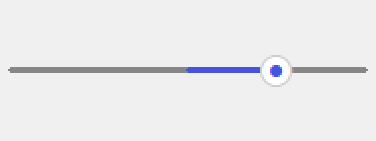
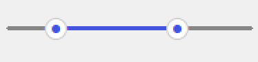

# TinUISheet

[TinUI](https://github.com/Smart-Space/TinUI)的高级滑动条控件。


> [!NOTE]
>
> `tinuislider`提供`sliderlight`和`sliderdark`两种**样式配色**。

---

## CenterSlider



`tinuislider.centerslider.CenterSlider`

```python
CenterSlider(
    canvas: BasicTinUI,
    pos: tuple,
    width=200,
    fg="#4554dc",
    activefg="#4554dc",
    bg="#868686",
    buttonbg="#ffffff",
    buttonoutline="#cccccc",
    data=(1, 2, 3, 4, 5),
    start=None, # 默认为中间索引
    direction="x",
    anchor="nw",
    command=None,
)
```

参数与TinUI原生`scalebar`一致。

> **注意**，`start`是索引，不是值。

> [!tip]
>
> 通过`CenterSlider.uid`获取控件标识符，用于TinUI面板布局。其对面板布局的响应与原生`scalebar`一致。

#### select(num)

选中某一项**索引**。

#### disable(sign='#C8C8C8')

禁用，`sign`为禁用时标识色。

#### active_state()

激活控件。

#### get()

获取当前**选中值**。

#### set(value)

选中某一项**值**，需要在`data`中。

#### 示例

```python
from tkinter import Tk
from tinui import ExpandPanel, VerticalPanel
def on_resize(event):
    rp.update_layout(10,10,event.width-10,event.height-10)
r=Tk()

ui=BasicTinUI(r)
ui.pack(fill='both',expand=True)

slider = CenterSlider(
    canvas=ui,
    pos=(0, 100),
    width=200,
    data=range(-10,11),
    start=3, # start是索引，不是值，所以这里是选中数据中的第4项
    anchor="center",
    command=lambda v: print(f"Selected: {v}")
)

# 获取当前值
val = slider.get()
print(f"Current value: {val}")
slider.set(5)  # 设置选中值为 5
print(f"Value after set: {slider.get()}")

rp = ExpandPanel(ui)
vp = VerticalPanel(ui)
rp.set_child(vp)

ep1 = ExpandPanel(ui)
vp.add_child(ep1, weight=1)
ep1.set_child(slider.uid)

ui.bind("<Configure>", on_resize)

r.mainloop()
```

## RangeSlider



`tinuislider.rangeslider.RangSlider`

```python
RangeSlider(
    canvas: BasicTinUI,
    pos: tuple,
    width=200,
    fg="#4554dc",
    activefg="#4554dc",
    bg="#868686",
    buttonbg="#ffffff",
    buttonoutline="#cccccc",
    data=(1, 2, 3, 4, 5),
    start_left=None,
    start_right=None,
    direction="x",
    anchor="nw",
    command=None,
)
```

- start_left::小段索引
- start_right::大端索引

#### disable(sign='#C8C8C8')

禁用。

#### active_state()

激活控件。

#### get()

获取当前大小两端**选值**。

#### set(left=None, right=None)

设置大小两端**选值**，需要在`data`中。可单独设置。

#### 示例

```python
from tkinter import Tk
from tinui import ExpandPanel, VerticalPanel
def on_resize(event):
    rp.update_layout(10,10,event.width-10,event.height-10)
def on_change(val):
    print("Range:", val)

root = Tk()
root.geometry("400x200")

ui = BasicTinUI(root)
ui.pack(fill="both", expand=True)

slider = RangeSlider(
    canvas=ui,
    pos=(100, 100),
    width=250,
    data=list(range(0, 101, 10)),
    start_left=2,
    start_right=7,
    anchor="center",
    direction='y',
    command=on_change,
)

rp = ExpandPanel(ui)
vp = VerticalPanel(ui)
rp.set_child(vp)

ep1 = ExpandPanel(ui)
vp.add_child(ep1, weight=1)
ep1.set_child(slider.uid)

ui.bind("<Configure>", on_resize)

root.mainloop()
```

